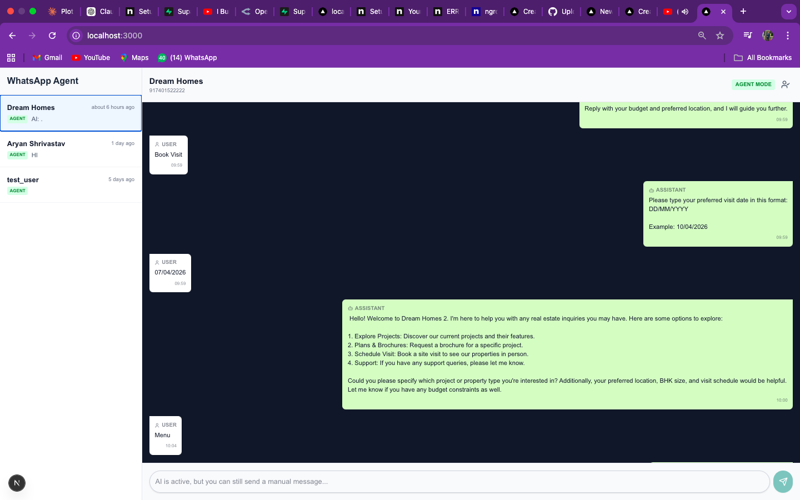

# 🤖 WhatsApp AI Chatbot

A full-stack WhatsApp chatbot built with:
- Next.js
- Supabase
- WhatsApp Cloud API
- OpenRouter (AI)

---

## 🚀 Features

- 💬 Real-time WhatsApp chat
- 🤖 AI auto-replies (Agent Mode)
- 👨 Human takeover mode
- 📊 Dashboard to manage conversations
- 🔗 Webhook integration (Meta API)

---

## 🛠️ Tech Stack

- Next.js (Frontend + API)
- Supabase (Database)
- WhatsApp Cloud API
- OpenRouter AI

---

## 📂 Project Structure

## ⚙️ Setup Instructions

### 1. Clone repo
git clone https://github.com/nikhilthakur01/WhatsAPP-Agent.git
cd WhatsAPP-Agent

### 2. Install dependencies
npm install

### 3. Setup environment variables

Create `.env.local`

NEXT_PUBLIC_SUPABASE_URL=
NEXT_PUBLIC_SUPABASE_ANON_KEY=
SUPABASE_SERVICE_ROLE_KEY=

WHATSAPP_PHONE_NUMBER_ID=
WHATSAPP_ACCESS_TOKEN=
WHATSAPP_VERIFY_TOKEN=

OPENROUTER_API_KEY=

### 4. Run project
npm run dev 

## 🌐 Webhook Setup

Run ngrok:

ngrok http 3000

Webhook URL:
(https://anjanette-unabetting-exactly.ngrok-free.dev)

## 👨‍💻 Author

Nikhil Kumar

## 🔥 Live Demo
Coming Soon...
